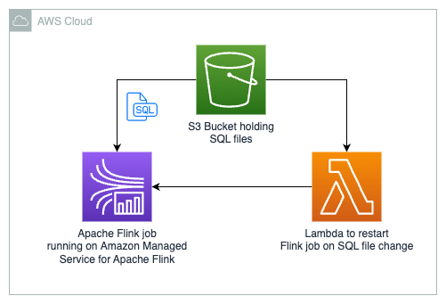

# SQL based streaming analytics using Apache Flink running on Amazon Managed Service for Apache Flink

## Problem statement
Getting streaming analytics right is a big challenge for many organisations. Not only do you need a background in general data science you also need to have a good understanding of the data you want to analyze and the requirements that are leading to the need of streaming analytics. On top of that developers need to learn the Apache Flink DataStreamAPI. This solutions enabled business analysts - which often are knowledgeable in SQL - to write SQL based streaming analytics applications based on Apache Flink. This opens up the field of streaming analytics to a much broader audience. 

## Solution description
This solution demonstrates how to perform streaming analytics using a SQL file. Center to this solution is Apache Flink. The `sql-based-streaming-analytics-flink-job` is a generic Apache Flink job which retrieves a SQL file from a S3 Bucket on startup. Afterwards the SQL file is being parsed and submitted to the Apache Flink Environment. Using a Lambda trigger the Apache Flink job is being restarted whenever a SQL file in the S3 Bucket is being changed.

When installing this solution you have two choices:
* Install only the core solution which creates:
  * S3 Bucket containing all the SQL files found in the `sql` folder
  * One Apache Flink job running on Amazon Managed Service for Apache Flink (Amazon MSF) for every SQL file in the `sql` folder
  * Lambda which is triggered whenever a SQL file in the bucket is being changed
* Install the full solution which includes:
  * All elements of the core solution
  * Kinesis Data Stream which is used as an input stream for the Apache Flink Job 
  * Kinesis Data Stream which is used as an output stream for the Apache Flink Job
  * An ElasticBeanstalk application providing a web interface to:
    * Generate and write sample data into the input stream
    * Read from the output stream
    * See the status of the Apache Flink jobs 

The generic Apache Flink job is available as a GitHub Release from this repository. Prior to deploying the CDK code it is being downloaded.

## Core Solution architecture


## Full Solution architecture


## Install the core solution
After cloning the repository change into the `sql-based-streaming-analytics-cdk`directory and simply run the following command:

```shell
cdk deploy core-solution-stack
```

## Install the full solution
After cloning the repository change into the `sql-based-streaming-analytics-cdk`directory and simply run the following command:

```shell
cdk deploy --all
```

## Getting started using the full-solution
After installing the full solution you find the URL of the deployed web application in your command line outputs. After clicking that link a browser should open and you should be able to explore the DataAcccessUi.
On the top of the page you see some status badges. One giving you information if the Random Data Generator is running the other one showing you if you're connected to the WebSocket (used for pushing new elements on the output Kinesis Data Stream).
To simply try out the solution click on the `Start MSF application` of the `simpleSqlMsfApplication*` Apache Flink job. Starting the Apache Flink job takes approximately 2-3 minutes. During this time you can simply reload the web page and look at the status badge of the application. 
After the Apache Flink job running on Amazon MSF is started you see a `Running` badge inside the `simpleSqlMsfApplication*` card.
Now just start the random data generation by expanding the `Data generator` box and click on `Start data generation`.
After expanding the `Data output` box you should see entries coming in. These have been processed by the Apache Flink job which is executing the `simpleSql.sql` file out of the `sql` folder.

### Modifying the random data generator
The random data generator is based on the [Datafaker](https://www.datafaker.net/) library. Therefore you can use any of the supported expressions inside your message. Please consult the [Datafaker documentation](https://www.datafaker.net/documentation/getting-started/) for more information on [Datafaker expressions](https://www.datafaker.net/documentation/expressions/).
If you don't want to use Datafaker for your body or your partition key value make sure to uncheck the checkboxes accordingly.
If you want to reference a value of your JSON message to use as a partion key value you can use the [JSON pointer notation](https://www.rfc-editor.org/rfc/rfc6901). These follows an approach known from filesystems.
Given the following JSON object

```json
{
  "customer": {
    "name": "John",
    "lastname": "Doe",
    "address": {
      "city": "Downtown",
      "zip": 12345
    }
  }
}
```
you can access the city using this JSON pointer:
`/customer/address/city`

### Automatically apply a changes SQL
To update the Apache Flink application running on Amazon MSF this solution has an update mechanism built in. 
Let's imagine we want to display not only the productId but also the productName within the simpleSql job.
We can change the SQL file to this:
``` sql
/*
 * Copyright 2023 Amazon.com, Inc. or its affiliates. All Rights Reserved.
 *
 * Licensed under the Apache License, Version 2.0 (the "License"). You may not use this file except in compliance
 * with the License. A copy of the License is located at
 *
 * http://www.apache.org/licenses/LICENSE-2.0
 *
 * or in the 'license' file accompanying this file. This file is distributed on an 'AS IS' BASIS, WITHOUT WARRANTIES
 * OR CONDITIONS OF ANY KIND, express or implied. See the License for the specific language governing permissions
 * and limitations under the License.
 *
 *
 */

CREATE TABLE orderIn
(
    customerId   INT,
    customerName VARCHAR(800),
    productId    INT,
    productName  VARCHAR(800),
    eventTime_ltz AS PROCTIME()
) PARTITIONED BY (customerId)
WITH (
'connector' = 'kinesis',
'stream' = '##INPUT_STREAM_NAME##',
'aws.region' = '##REGION##',
'scan.stream.initpos' = 'LATEST',
'format' = 'json',
'json.timestamp-format.standard' = 'ISO-8601');

CREATE TABLE orderOut
(
    customerId INT,
    productId  INT,
    productName VARCHAR(800)
) PARTITIONED BY (customerId)
WITH (
'connector' = 'kinesis',
'stream' = '##OUTPUT_STREAM_NAME##',
'aws.region' = '##REGION##',
'format' = 'json',
'json.timestamp-format.standard' = 'ISO-8601');

INSERT INTO orderOut
SELECT customerId, productId, productName
FROM orderIn;
```

If you switch to your Amazon S3 Bucket named `sqlbasedstreaminganalyticsc-sqlfilebucket...` in your AWS Console you can see the all the SQL files in the bucket which are also in the `sql` folder of this project. Inside the AWS console you can click on `Upload` and upload the updated simpleSql.sql file.
The upload triggers the `restartMsfApplication`-Lambda which updates the Amazon MSF application. You can check the status of the application updating inside the AWS Console by looking at the Managed Apache Flink service page or inside the deployed DataAccessUi.
