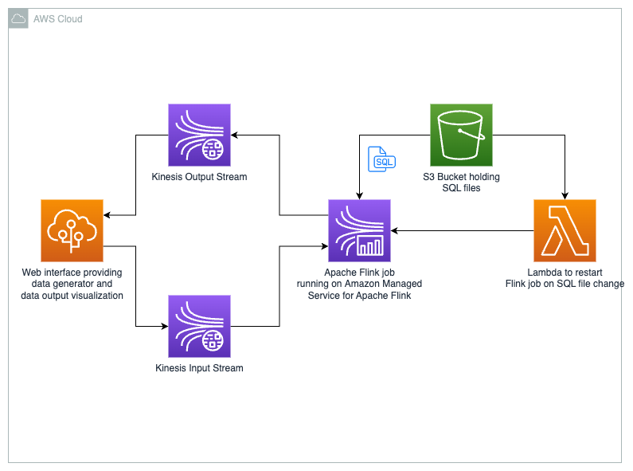

# SQL based streaming analytics using Apache Flink running on Amazon Managed Service for Apache Flink

## Solution description
This solution demonstrates how to perform streaming analytics using a SQL file. Center to this solution is Apache Flink. The `sql-based-streaming-analytics-flink-job` is a generic Apache Flink job which retrieves a SQL file from a S3 Bucket on startup. Afterwards the SQL file is being parsed and submitted to the Apache Flink Environment. Using a Lambda trigger the Apache Flink job is being restarted whenever a SQL file in the S3 Bucket is being changed.

When installing this solution you have two choices:
* Install only the core solution which creates:
  * S3 Bucket containing all the SQL files found in the `sql` folder
  * One Apache Flink job running on Amazon Managed Service for Apache Flink (Amazon MSF) for every SQL file in the `sql` folder
  * Lambda which is triggered whenever a SQL file in the bucket is being changed
* Install the full solution which includes:
  * All elements of the core solution
  * Kinesis Data Stream which is used as an input stream for the Apache Flink Job 
  * Kinesis Data Stream which is used as an output stream for the Apache Flink Job
  * An ElasticBeanstalk application providing a web interface to:
    * Generate and write sample data into the input stream
    * Read from the output stream
    * See the status of the Apache Flink jobs 

The generic Apache Flink job is available as a GitHub Release from this repository. Prior to deploying the CDK code it is being downloaded.

## Core Solution architecture


## Full Solution architecture


## Install the core solution
After cloning the repository change into the `sql-based-streaming-analytics-cdk`directory and simply run the following command:

```shell
cdk deploy core-solution-stack
```

## Install the full solution
After cloning the repository change into the `sql-based-streaming-analytics-cdk`directory and simply run the following command:

```shell
cdk deploy --all
```

## Getting started using the full-solution
After installing the full solution you find the URL of the deployed web application in your command line outputs. After clicking that link a browser should open and you should be able to explore the DataAcccessUi.
On the top of the page you see some status badges. One giving you information if the Random Data Generator is running the other one showing you if you're connected to the WebSocket (used for pushing new elements on the output Kinesis Data Stream).
To simply try out the solution click on the `Start MSF application` of the `simpleSqlMsfApplication*` Apache Flink job.
After the Apache Flink job running on Amazon MSF is started you see a `Running` badge inside the `simpleSqlMsfApplication*` card.
Now just start the random data generation by expanding the `Data generator` box and click on `Start data generation`.
After expanding the `Data output` box you should see entries coming in. These have been processed by the Apache Flink job which is executing the `simpleSql.sql` file out of the `sql` folder.
